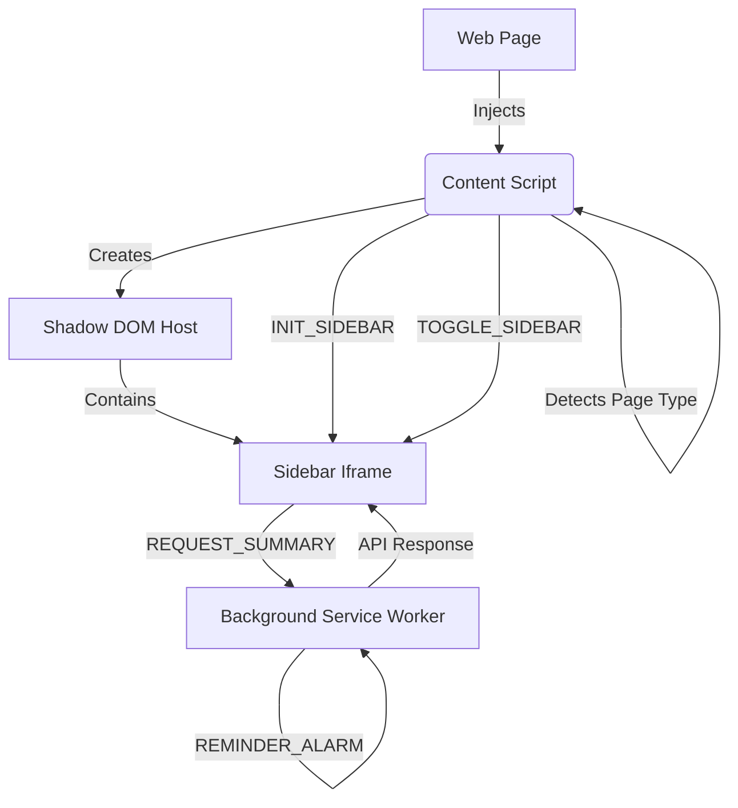

# 🏗️ System Architecture

This extension follows a **Manifest V3** event-driven architecture. It relies heavily on message passing between isolated contexts (Content Script, Sidebar Iframe, and Background Service Worker).

## High-Level Diagram

## Components

### 1. Content Script (`content/`)
*   **Role**: The bridge between the host page and the extension.
*   **Responsibilities**:
    *   Injects the floating trigger button and the Sidebar iframe (encapsulated in Shadow DOM).
    *   Runs heuristics (`page-detector.js`) to determine if the page is a Blog, Shop, or Dev site.
    *   Listens for DOM events (like clicking a code block) to trigger sidebar actions.

### 2. Sidebar UI (`sidebar/`)
*   **Role**: The main user interface, running inside an `<iframe>`.
*   **Responsibilities**:
    *   Displays the UI based on the detected `pageType`.
    *   Manages internal state (Chat vs Reminders vs Research tabs).
    *   Sends user intents (e.g., "Summarize this") to the Background script.
*   **Why an Iframe?**: To ensure CSS isolation. The sidebar styles will never clash with the website's styles.

### 3. Background Worker (`background/`)
*   **Role**: The central logic handler & persistent state manager.
*   **Responsibilities**:
    *   Handles "heavy lifting" (API calls, AI processing).
    *   Manages `chrome.alarms` for reminders.
    *   Persists data to `chrome.storage` (Settings, Research Sessions).
    *   Coordinates cross-component communication.

## Data Flow Example: "Summarize Page"

1.  User clicks **"Summarize"** button in Sidebar.
2.  **Sidebar** sends `{ action: "REQUEST_SUMMARY", url: "..." }` to **Background**.
3.  **Background** receives message:
    *   (Future) Calls LLM API with the URL/Context.
    *   (Current) Waits 1.5s (simulated delay).
    *   Returns `{ data: "Summary text..." }`.
4.  **Sidebar** receives response and updates the `.result-box` DOM.

## See Also
*   [Routing & State Logic](./ROUTING.md)
*   [Development Guide](./DEVELOPMENT.md)
